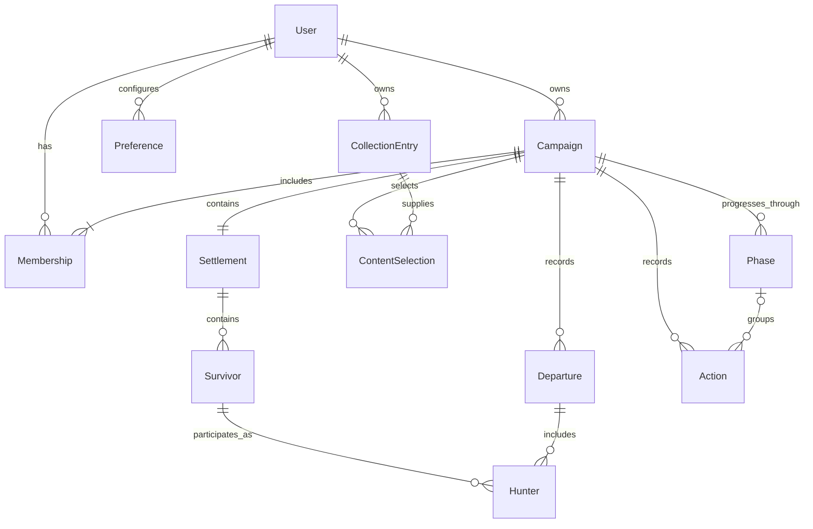
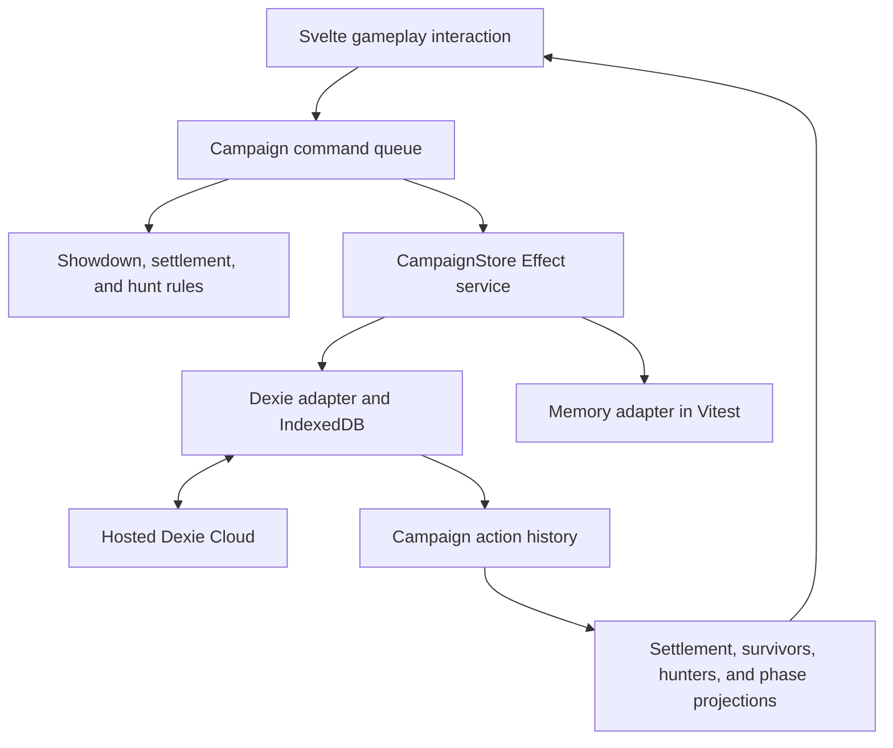
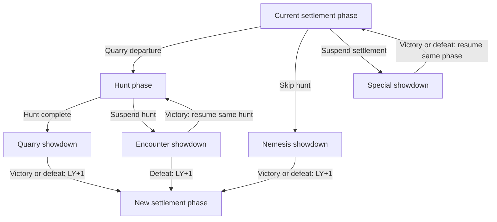

# Local-first KDM architecture

Status: proposed design. Dexie, Dexie Cloud, and the campaign services below are not yet installed or implemented.

## Scope and existing behavior

Guidepost must support guest use and offline saves. Signed-in users must be able to synchronize across devices and share campaigns.
Gameplay uses an action history; collection tracking, campaign management, and preferences use current records.

| Area                | Data                                                             | Gameplay undo           |
| ------------------- | ---------------------------------------------------------------- | ----------------------- |
| Collection          | Owned content, editions, wishlist, and related details           | None                    |
| Campaign management | Setup, names, ongoing/archived status, ownership, and membership | None                    |
| Campaign gameplay   | Settlement, survivors, hunters, progress, and phase state        | Every game-state change |
| Preferences         | Account and device settings                                      | None                    |
| Catalog             | Bundled, versioned reference data                                | None                    |

The collection currently saves complete snapshots through this path:

```text
ContentState -> OptimisticStore -> GuestStore -> BrowserStorage
```

[`OptimisticStore`](../src/lib/state/optimistic-store.ts) applies field patches immediately and serializes persistence.
[`GuestStore`](../src/lib/state/stores.ts) implements `CollectionStore` through
[`BrowserStorage`](../src/lib/state/browser-storage.ts). This queue has no durable undo history. A Dexie migration must preserve the
`CollectionStore` boundary and migrate existing data explicitly.

## Domain relationships



This diagram describes domain relationships. Gameplay entities may be projections of history rather than separate synchronized tables.

- Each campaign has exactly one owner, who is also a member, and exactly one settlement.
- Users can belong to many campaigns; campaigns can have many members.
- Each ContentSelection belongs to one campaign and derives from an owned CollectionEntry in a user's collection.
- A settlement belongs to one campaign and contains its survivors, including historical survivors.
- A survivor belongs to one settlement. Player control of a survivor does not confer record or campaign ownership.
- Each Hunter references one settlement survivor and one departure in the same campaign. A departure has at most one Hunter per survivor.
- Every phase and gameplay action belongs to one campaign. All references must stay within that campaign.
- Phase occurrences have stable IDs. An interrupted phase keeps its ID and progress when resumed.
- Initialization and campaign-wide actions may have no phase reference.

Derive campaign and survivor lists from memberships and references. The settlement projection can use `campaignId` as its key.
The persistence adapter must enforce relationships; IndexedDB does not enforce foreign keys.

## Hunters and departures

A Hunter is a survivor's temporary participation in a departure. It references the settlement survivor through `survivorId` and groups
with other participants through `departureId`. Hunt and showdown rosters contain Hunters; the settlement retains the full survivor roster.

| State                                                                 | Owner               |
| --------------------------------------------------------------------- | ------------------- |
| Survivor identity, permanent attributes, and lasting changes          | Settlement survivor |
| Armor points, temporary gear bonuses, and hunt/showdown display order | Hunter              |
| Monster state and hunt progress                                       | Phase occurrence    |

Read permanent survivor information through the reference. Derive bonuses from gear and recorded modifiers where possible. Hunter
gameplay changes use campaign commands; lasting outcomes update the survivor explicitly rather than copying all Hunter fields back.

The departure defines the Hunter lifecycle:

1. Create Hunters for selected survivors during departure preparation in settlement.
2. Keep their IDs through hunt, encounter showdowns, and the quarry showdown. Nemesis and special showdowns can create a departure without a hunt.
3. Keep returning Hunters through settlement return processing; apply return-specific lasting outcomes once.
4. Close the departure and remove its Hunters from active state. A later departure creates fresh Hunters without carrying over temporary values.

Individual fields can have shorter lifetimes than the departure. Define their initialization and reset rules for hunt entry, showdown
entry, resumption, and return. Reusing a Hunter ID does not imply retaining every field across those transitions. Settlement preparation
and return processing can expose Hunters alongside survivors, including when a special showdown resumes the same settlement phase.

Save and synchronize active Hunter state through campaign history. Temporary describes its gameplay lifetime, not memory-only storage.
Closing a departure preserves the history needed for rewind while excluding its temporary values from later gameplay.

## Ownership, membership, and campaign lists

Store one canonical campaign owner identity. Memberships associate users with campaigns and permissions. Pending invitations do not
count as active memberships. Derive each user's campaign list from memberships and campaign status, including owned campaigns.

Archiving preserves settlement data, survivors, history, and memberships. Personal hiding or pinning belongs in user preferences.

Proposed management policy: the owner controls invitations, permissions, archive/restore, and ownership transfer. Archived campaigns
remain visible and read-only until restored. Transfers must preserve one owner and consistent access; an owner cannot leave a campaign
ownerless. These management policies remain open decisions.

The owner can delegate gameplay control without transferring ownership. Membership changes and management operations are outside
gameplay undo. Rewind must never restore an old access grant.

## Collection, campaign content, and preferences

Campaign setup derives available choices from the user's owned CollectionEntry records. The user selects specific items from that
collection for the linked campaign. Store those choices as ContentSelection records with the campaign reference, source user and
collection-entry reference, and selected catalog content ID, edition, and rules version. The same collection entry can supply content
to multiple campaigns, each with its own selection.

Available choices follow collection ownership; saved campaign selections persist independently of later collection edits or membership
changes. Keep the selected content and source reference if the collection entry is removed. Use of other members' content requires an
explicit selection policy. Sharing a campaign exposes its selections without granting access to personal collections.

Setup remains editable before play. Starting play records the selected rules and initial settlement and survivors as a versioned
baseline. Later gameplay-affecting content changes require validation and history entries, even if initiated in the campaign manager.
Replay uses the recorded rules version.

Account preferences can synchronize privately; device settings stay local. Collection and preference sync is optional and independent
of campaign sync. Neither requires action history or a collaborative real-time UI.

## Components and data flow

Use Dexie for IndexedDB persistence, hosted Dexie Cloud for synchronization, Effect v4 for workflows and service dependencies, and
Svelte for interaction and display. The browser connects directly to Dexie Cloud, so this design needs no custom application backend.



| Service             | Responsibility                                             |
| ------------------- | ---------------------------------------------------------- |
| `CollectionStore`   | Personal collection persistence                            |
| `PreferencesStore`  | Account and device preferences                             |
| Campaign management | Creation, listing, setup, metadata, status, and membership |
| `CampaignStore`     | Read gameplay history and atomically commit actions        |
| Campaign commands   | Serialize local commands and invoke phase rules            |
| Auth and sync       | Identity, access changes, and cloud status                 |

Services may share one Dexie connection. Use an adapter transaction for workflows spanning management and gameplay. Campaign creation
atomically establishes metadata, owner membership, and one settlement baseline. Starting play atomically records setup and initial
history.

Use separate access scopes for private and campaign data. Local-only data can use a separate database or unsynced tables. Keep the
catalog bundled.

## Campaign phases and shared state

All showdown contexts use the same data model, commands, features, and undo support. Record showdown context separately from monster
identity. Each resolved showdown has one outcome: survivor victory or defeat.

| Showdown context   | Entry                | Victory                      | Defeat                       | Lantern-year change    |
| ------------------ | -------------------- | ---------------------------- | ---------------------------- | ---------------------- |
| Normal quarry      | After hunt           | New settlement phase         | New settlement phase         | +1                     |
| Normal nemesis     | Skip hunt            | New settlement phase         | New settlement phase         | +1                     |
| Hunt encounter     | Interrupt hunt       | Resume same hunt             | New settlement phase         | Victory: 0; defeat: +1 |
| Settlement special | Interrupt settlement | Resume same settlement phase | Resume same settlement phase | 0                      |



Settlement information, survivors, resources, equipment, and lantern year belong to campaign state. Hunters carry departure-specific
participant state; monster state and hunt progress belong to phase occurrences. A new settlement phase uses the existing settlement
entity. Multiple phase occurrences can share a year.

Persist the active phase, phase lifecycle states, and interrupting showdown's parent/return phase ID. Suspend the parent during the
showdown. On return, resume its saved progress with shared-state changes applied. Encounter defeat closes the hunt instead. Suspended
phases cannot advance. These states must survive reloads and sync.

Resolve each showdown in one atomic command that records its outcome, consequences, phase changes, and any year advancement. Resuming
a phase must not repeat its start effects. Duplicate resolution requests must not repeat consequences or advance the year twice.
Conflicting outcomes from different devices require reconciliation.

Navigation only changes the view. The persisted active phase controls gameplay, and the campaign queue survives phase navigation.

## Commands, events, and projected state

A command describes intent; its accepted events record the changes. Store serializable data. Each command has a stable ID, campaign
ID, optional phase ID, actor, schema version, payload, and required dependencies. Events reference their command. Commit all events
from one command together as one undo step.

Create IDs and random outcomes once. Retries reuse IDs; replay and redo reuse recorded rolls and draws.

Keep game rules in ordinary pure functions:

- `decide(state, command)` validates the command and returns events or a domain failure.
- `project(history)` derives gameplay state from the baseline, events, and undo/redo entries.

All edits to replayed state pass through commands, regardless of their screen. Display names, memberships, and preferences use current
records. Receiving remote events updates the projection without rerunning commands or external effects. Validate persisted records
with versioned schemas and report unsupported versions explicitly.

Add rebuildable checkpoints when replay needs optimization. Key them by history and projection version; include active Hunters,
departure and phase lifecycle, return references, outcomes, and lantern year. Earlier edits invalidate affected checkpoints. Gameplay
projections remain derived caches. Retain enough history for the promised rewind depth.

## Undo, redo, and rewind

Gameplay undo covers showdown, settlement, and hunt. Group drags and confirmed edits into useful undo steps. Temporary view state,
authentication, and management operations stay outside gameplay history.

Append undo/redo entries targeting an action while preserving its original events. Undo removes only that action's contribution. If
Nick and Sam each add a wound, undoing Nick's action leaves Sam's wound.

| Action                                | Undo behavior                                                      |
| ------------------------------------- | ------------------------------------------------------------------ |
| Independent counter change            | Remove its contribution                                            |
| Position, equipment, or status change | Restore prior state and account for later dependencies             |
| Resource spending or survivor changes | Reverse grouped effects and dependent actions                      |
| Phase resolution                      | Reverse consequences, phase changes, and year advancement together |
| Random result                         | Undo its effects; redo restores the recorded result                |

Proposed UI policy: undo/redo targets the player's latest applicable action in the current phase. An authorized controller can rewind
across phases after reviewing affected actions. Reversing a reward must also address crafting that consumed it.

Rewinding encounter defeat restores the hunt and reverses the new settlement phase and year advancement. Rewinding interruption or
resumption restores phase lifecycle and progress. Dependencies can cross phase IDs, including actions before an interrupted showdown.
Completing a phase preserves its history.

Rewind must also restore Hunter creation, temporary fields, and departure lifecycle. Reversing return processing must address lasting
survivor changes and restore the returning Hunters together.

Concurrent undo requests must remove a contribution once. Undo references the action activation; redo references its reversal. A delayed
undo must not cancel a later redo. The representation, conflict policy, rewind depth, and permissions remain open decisions.

## Effect services and persistence contract

Define `CampaignStore` as a small `Context.Service` with Effect-returning methods. Supply Dexie and memory implementations. Commands
depend on this contract. Phase modules share the service and queue while retaining separate rules.

| Operation          | Contract                                                                 |
| ------------------ | ------------------------------------------------------------------------ |
| `read(campaignId)` | Return validated history, relevant inputs, and a local version token     |
| `commit(change)`   | Check the token and atomically persist events and a deduplication record |

Both implementations must:

1. Return success for an identical committed command without applying it again, before checking its stale token.
2. Reject an ID reused with different content.
3. Return a typed stale-input failure when relevant inputs changed.
4. Commit every event together or none.
5. Enforce campaign references and phase invariants.
6. Report local persistence success independently of cloud acceptance.

The token detects other-tab writes, incoming sync, reconciliation removals, and management changes affecting command validity. Its
implementation is unresolved. A process-local counter cannot cover these changes, and the token provides no distributed lock.

```text
campaign queue -> read -> project -> decide -> atomic commit -> publish
```

Use one semaphore per active campaign to serialize preparation and commit. Add an Effect Queue only if work inspection or backpressure
is needed. The queue is temporary; committed history is durable. The collection queue continues to serialize persistence only.

Bound retries and preserve intent and random results. Cancellation after a successful commit requires an undo to reverse gameplay.
Settle an in-flight write before releasing the queue. Dexie Cloud owns network retries.

Use named `Effect.fn` operations, feature-owned `Schema.TaggedError` failures, and `Layer.effect` implementations. The Dexie adapter
owns transactions and translates SDK failures. Keep unrelated asynchronous work outside
[IndexedDB transactions](<https://dexie.org/docs/Dexie/Dexie.transaction()>).

Reuse a `ManagedRuntime` for the application or campaign session; dispose it when its owner ends. Auth and sync status are separate
services, so game commands and memory tests need no login or connection.

## Sharing and synchronization

Use one realm per shared campaign for setup and gameplay. Map membership to Dexie Cloud member records and the campaign owner to realm
ownership. Include the owner as a member for sync access. Keep collections and account preferences private.

Cloud `realmId` controls visibility; reserved `owner` metadata grants record privileges. Configure these independently of actor
attribution so appending an action does not grant unintended management rights. A domain `ownerId` alone grants no cloud authority.
See [Dexie Cloud access control](https://dexie.org/docs/cloud/access-control).

Dexie Cloud supplies authentication and real-time WebSocket updates. All phases synchronize within the campaign. Local commits work
offline and sync when connected. No application WebSocket server is needed. See
[configuration](<https://dexie.org/docs/cloud/db.cloud.configure()>).

Dexie Cloud preserves transaction atomicity during sync. Custom client rules and the local queue do not provide global command
validation or ordering. See [consistency guarantees](https://dexie.org/docs/cloud/consistency).

Proposed cooperation policy: players control assigned survivors, and a designated controller advances shared actions and phases.
The controller need not own the campaign. Define reconciliation for handoffs, late offline edits, and conflicting outcomes or
transitions. Timestamp order alone does not establish causality or game validity. Strict server enforcement would require an
authoritative command processor.

Display local save and cloud status separately. Permission changes can reject saved actions during sync. Rebuild from reconciled history
and identify affected actions; application history is immutable, but the sync layer can remove rejected records.

## Guest adoption and offline UI

Guests use a stable local identity. Account adoption preserves entity and command IDs, maps ownership to the account, and retains
historical actor attribution. Shared membership requires authentication. Actor labels never authorize writes.

Define upload opt-in and handling of unsynced work during logout/account changes. Dexie Cloud can attach guest data on login; selective
upload requires separate local drafts until chosen. Campaign login must not silently upload unrelated personal data.

Svelte observes local history and metadata through adapter subscriptions, such as `liveQuery`. Release subscriptions with their owner.
UI callbacks run commands and report typed failures without treating interruption as failure. Keep any optimistic overlay separate
from committed history; remove only the failed action's overlay.

The SvelteKit service worker caches app assets; IndexedDB stores campaign data. Offline use requires cached assets and local data.
Review existing registration before adding Dexie Cloud worker behavior.

## Tests and implementation sequence

Use Vitest and the version-aligned `@effect/vitest` adapter. Existing
[storage tests](../test/stores.test.mts) demonstrate injection. Memory layers allocate fresh state in `Layer.effect`, use atomic `Ref`
updates, and match the Dexie contract. They need no browser, IndexedDB, Dexie import, credentials, or network.

| Test layer                                           | Coverage                                                                                                                                                                      |
| ---------------------------------------------------- | ----------------------------------------------------------------------------------------------------------------------------------------------------------------------------- |
| Pure rules and commands with memory services         | Relationships, content stability, phase routes, undo dependencies, random replay, deduplication, stale inputs, malformed versions, failures, cancellation, and conflict rules |
| Shared memory/Dexie contract suite and browser tests | Adapter guarantees, transactions, reloads, checkpoints, and competing tabs                                                                                                    |
| Cloud integration                                    | Two devices, offline reconnects, sharing permissions, guest adoption, and rejected writes                                                                                     |

Test every transition in the phase table, including year advancement exactly once and parent progress on resume. Rewind must restore
outcomes, phase lifecycle, and year consistently. Also test campaign isolation, membership-based lists, and management/preferences
remaining outside undo. Use `Deferred` for concurrency and `TestClock` for time; control failures through test services.

Test Hunter references, field resets, stable IDs through interrupted hunts, return processing, and fresh state on later departures.
Reload and sync must preserve active Hunters; rewind must restore them after departure closure.

Implementation order:

1. Define versioned models, phase rules, dependencies, and undo semantics.
2. Build pure rules, memory services, and transition/rewind tests.
3. Add Dexie adapters and verify creation, persistence, reloads, and concurrency.
4. Connect campaign management and phase UIs to services and history controls.
5. Add optional auth and sync after defining adoption, permissions, and reconciliation.

Validate two devices with normal year advancement, settlement crafting and rewind, hunt victory/resumption, hunt defeat, and settlement
interruption/resumption. Include offline edits and a rejected write. Collection migration and preference sync can proceed independently.

## Open decisions

- Physical schema and local version token.
- Undo/redo conflict representation, rewind depth, and permissions.
- Controller handoff, event ordering, and offline reconciliation.
- Management permissions, archive behavior, and ownership transfer.
- Guest adoption, upload opt-in, and unsynced work during account changes.
- Hunter field initialization/reset rules, return processing, and shared versus per-user display order.
