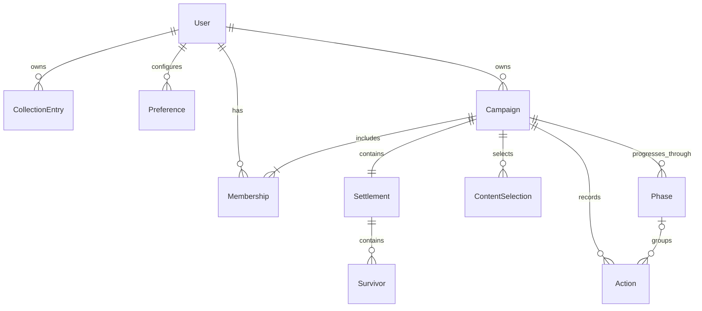
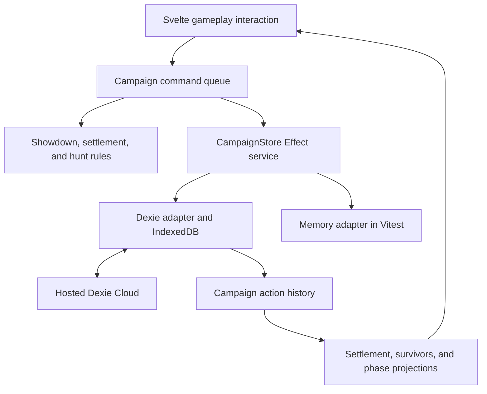
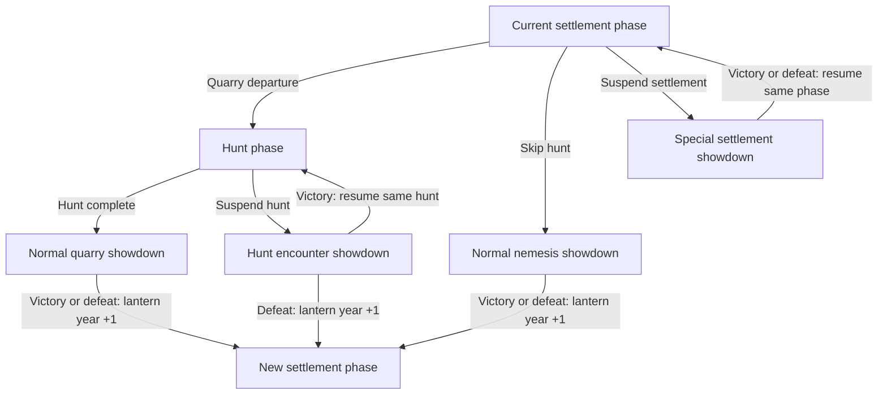

# Local-first KDM architecture

Status: proposed design. This document records the direction for collection tracking, campaign management, gameplay, preferences,
persistence, and synchronization. It replaces the earlier showdown-only design. Dexie, Dexie Cloud, and the proposed campaign services
are not implemented or installed in the application yet. Names below describe intended responsibilities, not existing exports.

## Scope and existing behavior

Guidepost should work as a guest, save locally, and remain usable offline. Signed-in users should be able to synchronize across devices
and participate in shared campaigns. Showdown, settlement, and hunt have branching transitions within a campaign, including showdowns
that interrupt and then resume a hunt or settlement phase. Each campaign has exactly one owner and one settlement; the settlement
contains its survivors and persistent settlement information.

Use different persistence models for different responsibilities:

| Area                | Data                                                                                           | Persistence model                                  | Undo requirement                           |
| ------------------- | ---------------------------------------------------------------------------------------------- | -------------------------------------------------- | ------------------------------------------ |
| Collection          | A user's owned content, editions, wishlist, and related details                                | Current records                                    | None                                       |
| Campaign management | Creation, names, ongoing/archived status, ownership, membership, and initial content selection | Current records and explicit management operations | None                                       |
| Campaign gameplay   | Settlement information, survivors, progress, and showdown, settlement, and hunt phase state    | Recorded actions and derived state                 | All game-state changes in the three phases |
| Preferences         | Account settings and device-specific settings                                                  | Current setting values                             | None                                       |
| Catalog             | Reference content and catalog IDs                                                              | Bundled, versioned data                            | None                                       |

The collection currently uses this path:

```text
ContentState -> OptimisticStore -> GuestStore -> BrowserStorage
```

[`CollectionStore` and `GuestStore`](../src/lib/state/stores.ts) save complete collection snapshots through
[`BrowserStorage`](../src/lib/state/browser-storage.ts). [`OptimisticStore`](../src/lib/state/optimistic-store.ts) applies field patches
optimistically and serializes persistence. Its pending changes are not a durable undo history or a queue shared between devices.
Preserve these boundaries while introducing campaign support. A collection migration to Dexie is a separate change behind
`CollectionStore`, with an explicit migration of existing local data.

## Domain relationships



This is a logical model, not a final table schema. Settlement, survivor, and phase state can be projections of history rather than
independently editable synchronized rows. Initialization and campaign-wide rule changes can have actions without a phase reference.

The model has these invariants:

- A user has their own collection and may belong to many campaigns. A campaign may have many users.
- Each campaign has exactly one owner, who is also a member. Ownership is not a set of interchangeable administrators.
- Each campaign has exactly one settlement. Its settlement is not shared with another campaign.
- Each survivor belongs to one settlement and, through it, one campaign. A settlement can have many survivors, including historical
  survivors whose current status changes during play.
- A player's control of a survivor does not make that player the owner of the survivor record or the campaign.
- Each phase occurrence has a distinct ID and belongs to one campaign. The phase type alone, such as `hunt`, is not an identity.
- An interrupted phase retains its identity and progress while its showdown is active. Resuming it does not create a new phase.
- Every resolved showdown has exactly one survivor outcome: victory or defeat. Its context determines the next phase and whether the
  lantern year advances; the outcome alone does not determine the destination.
- Every gameplay action is scoped to one campaign. References to survivors, phases, and settlement data must stay within that campaign.

Use stable IDs and references. Do not embed a user's complete campaign list or a settlement's complete survivor list as a second mutable
source of truth. With one settlement per campaign, its projected record can be keyed by `campaignId`; survivors reference that key.
The physical schema must preserve these relationships, rather than assuming IndexedDB provides foreign-key enforcement.

## Ownership, membership, and campaign lists

Represent the domain's single owner with one canonical owner identity exposed by the campaign service. Resolve the owner's role from
that identity. Membership associates a user with a campaign and records their participation and granted permissions; an invitation
awaiting acceptance is separate from an active membership.

Derive each user's campaign list from their memberships and accessible campaign metadata, then group it by `ongoing` or `archived`.
Owned campaigns appear through the owner's membership as well. Archiving is a campaign-wide status change, not deletion or leaving a
campaign. It preserves the settlement, survivors, history, and memberships. If personal hiding or pinning is added, store it as a
user-specific preference rather than changing the campaign's shared status.

Recommended management policy: the owner manages invitations, member permissions, archive/restore, and any future ownership transfer.
Archived campaigns remain visible and are read-only until restored. These permission and archive behaviors need product confirmation
before implementation; the single-owner and membership relationships are requirements. An owner cannot simply leave an ownerless
campaign. Ownership transfer, if supported, must preserve exactly one owner and keep access permissions consistent.

Campaign ownership and gameplay control are different. The owner may delegate control of a phase or shared game actions to a member.
Changing the active controller does not transfer ownership. Membership changes, archive/restore, and ownership transfer are management
operations outside gameplay undo. A gameplay rewind must never restore an old membership or access grant.

## Collection, campaign content, and preferences

The collection informs campaign setup. Store an explicit selection of catalog content IDs, editions, and relevant rules versions for
each campaign. Default setup choices can come from the creating user's collection. Incorporating other members' available content is
an explicit future selection policy, not an automatic union of private collections.

Once selected, campaign content is independent of current ownership records. Marking an expansion as no longer owned, changing a
wishlist, or a member leaving must not silently remove content from an ongoing campaign. Sharing a campaign does not expose each
member's full collection.

Before play starts, setup is editable through the campaign manager. Starting play records the selected rules and initial settlement
and survivor state as a versioned baseline. Later content or rules changes that affect gameplay pass through campaign validation and
are recorded in history, even if their management screen has no undo button. History is also needed for interpretation and replay.
Do not replay old actions against whatever catalog data or rules happen to be current after an application update.

Keep preferences separate from gameplay. Account preferences can synchronize privately across the user's devices. Device-specific
settings stay local. Neither belongs in campaign action history. Lack of a real-time requirement does not imply that collection data
or preferences must remain local-only; their synchronization policy is independent of campaign collaboration.

## Components and data flow

Use Dexie for browser persistence, hosted Dexie Cloud for optional synchronization, and Effect v4 for commands, service dependencies,
typed failures, and resource lifetimes. Svelte reads projected state and dispatches commands.



The browser connects directly to the hosted service. No custom application backend is required for the initial cooperative companion
tool. Authentication, realm membership, and permissions control cloud access. A public client connection does not mean public data.

Keep feature services focused:

| Boundary                    | Responsibility                                                                                 |
| --------------------------- | ---------------------------------------------------------------------------------------------- |
| `CollectionStore`           | Personal collection persistence, preserving the existing interface until deliberately migrated |
| `PreferencesStore`          | Account and device preferences                                                                 |
| Campaign management service | Creation, listing, metadata, setup, archive/restore, and membership workflows                  |
| `CampaignStore`             | Read gameplay history and atomically commit gameplay actions                                   |
| Campaign command service    | Serialize local commands and coordinate pure phase-specific rules                              |
| Auth and sync services      | Identity, login, access changes, and cloud connection status                                   |

Management and gameplay services must coordinate through an explicit adapter transaction where a workflow spans both. Campaign
creation must establish metadata, its owner membership, and exactly one settlement baseline as one local unit. Starting play must
atomically capture the setup version and initial gameplay history. Avoid independently saving related pieces from UI callbacks.

Separate services do not imply separate physical databases. Adapters can share one Dexie connection and transaction boundary. A separate
local database or explicitly unsynced tables can hold data that must remain local. Keep account-private and campaign-shared data in
different access scopes even when they share a connection. The static catalog remains bundled reference data.

## Campaign phases and shared state

Model phase progression as explicit transitions with suspension and resumption, rather than a fixed showdown/settlement/hunt cycle.
There are four showdown contexts with different routes:

| Showdown context            | Entry                                   | Resolution destination                                              | Lantern-year change                              |
| --------------------------- | --------------------------------------- | ------------------------------------------------------------------- | ------------------------------------------------ |
| Normal quarry showdown      | After the hunt                          | Victory or defeat begins a new settlement phase                     | Advance by one on entering that settlement phase |
| Normal nemesis showdown     | Directly, skipping the hunt             | Victory or defeat begins a new settlement phase                     | Advance by one on entering that settlement phase |
| Hunt encounter              | Interrupts an existing hunt             | Victory resumes the same hunt; defeat begins a new settlement phase | Victory: no change; defeat: advance by one       |
| Special settlement showdown | Interrupts an existing settlement phase | Resolve victory or defeat, then resume the same settlement phase    | No advancement on resuming that phase            |



All four contexts use the same showdown data model, commands, UI features, and undo support. A hunt encounter may be a shorter or
smaller battle, but it does not need a reduced-feature showdown implementation. Record the routing context separately from monster
identity so a monster's catalog category does not accidentally decide whether to resume a phase or advance the year.

Every showdown ends in survivor victory or defeat. An active showdown has no terminal outcome yet. Record the outcome explicitly
when it resolves. Hunt-encounter victory resumes the interrupted hunt without advancing the lantern year. Defeat ends that hunt,
advances the lantern year by one, and begins a new settlement phase.

Persistent settlement information, survivor identities and attributes, resources, equipment, and progress belong to campaign gameplay.
Monster state, hunt progress, and other temporary phase information belong to a particular phase occurrence. Phase modules operate on
the same campaign state, rather than copying survivors or resources between three independent stores.

A new settlement phase still uses the campaign's one persistent settlement. It does not create a second settlement entity. Store the
lantern year as campaign progress and give phase occurrences independent IDs: several phases and interrupted showdowns can occur in
the same year.

Persist the active phase ID, each phase's lifecycle state, and an interrupted showdown's parent/return phase ID in the campaign history
and projection. Entering a hunt encounter or special settlement showdown suspends its parent and creates a distinct showdown instance.
The parent retains its hunt position or settlement progress. A return transition resumes that exact parent instance with the showdown's
survivor and other shared-state changes applied. Hunt-encounter defeat instead closes the interrupted hunt and starts a new settlement
phase. This must survive reloads and synchronization, not just page navigation. Prevent commands from advancing a suspended parent
while its showdown remains active.

A transition is one logical command with an atomic local commit. Resolving a normal quarry or nemesis showdown records victory or
defeat, applies the appropriate consequences, closes the showdown, advances the lantern year by one, and starts the new settlement
phase together. Resolving a hunt encounter in defeat similarly commits the outcome, consequences, closure of the showdown and hunt,
year advancement, and new settlement phase together. Other interrupting-showdown outcomes follow their defined return rules. Resuming
the same hunt or settlement must not repeat phase-start effects or advance the lantern year.

Give resolution commands stable identities and validate the showdown's current lifecycle, outcome, and return context. A repeated
request must not duplicate consequences, resume a parent twice, or advance the lantern year twice. Competing resolutions from separate
devices, including different outcomes for the same showdown, need reconciliation beyond local deduplication.

Persisted state determines the active phase. Navigating to a page only changes the view; it must not grant rewards or advance the game.
Keep the campaign's local command queue alive across phase navigation. Switching between campaigns must not mix their queues or history.

## Commands, events, and projected state

A command describes intent, such as adding a wound, spending settlement resources, resolving a hunt event, advancing a phase, undoing
an action, or redoing one. An accepted event records the resulting change. Store serializable data, not executable closures.

Each action needs a stable command ID, campaign ID, phase occurrence ID when applicable, actor identity, schema version, payload, and
the causal or dependency information needed by its rules. Events need stable identities and a link to their originating command.
Commit all events from one command together and group them as one undo step. Keep the campaign's realm on synchronized records.

Create IDs once per request and reuse them during retries. Record dice outcomes, draws, and other random results once. Replay and redo
use those recorded outcomes. Inject ID generation and randomness when testing workflows that create them.

Use ordinary pure functions for these operations:

- `decide(state, command)` validates a command through the relevant phase rules and returns events or a domain failure.
- `project(history)` calculates settlement, survivor, and phase state from the baseline, accepted events, and undo/redo decisions.

The baseline and history are the source of gameplay state. Metadata such as a campaign's display name, memberships, and preferences
does not need to be event-sourced. Any edit that changes replayed gameplay state must go through the gameplay boundary regardless of
which screen exposes it.

Begin with replaying the relevant campaign history. As histories grow, add rebuildable checkpoints at phase boundaries, keyed by the
history and projection version. Checkpoints include the active and suspended phases, return references, showdown outcomes, and lantern
year so replay preserves interrupted activity. Invalidate affected checkpoints when earlier history changes. Avoid independently
editable whole-state snapshots alongside the authoritative history. Derived settlement and survivor tables are caches, not additional
authorities.

Remote records feed the projection directly. Receiving an event must not dispatch its original command, reroll randomness, or repeat
external effects. Decode persisted and synchronized records with versioned schemas. Unsupported versions produce an explicit
compatibility state rather than silently discarding actions. Checkpoint retention must preserve the promised undo/rewind depth.

## Undo, redo, and rewind

All game-state changes during showdown, settlement, and hunt need undo support. Collection edits, preferences, campaign management,
authentication, and membership workflows do not need gameplay undo. Temporary UI state such as focus or an open menu stays local.
Group continuous interactions, such as a completed drag or a confirmed form edit, into useful undo steps.

Record undo and redo as additional history entries targeting a specific action. Preserve the original history. Do not restore an old
whole-campaign snapshot over other players' changes.

```text
Action A: Nick adds one wound.
Action B: Sam adds one wound.
Action C: Nick undoes A.

The resulting wound count is one. Sam's contribution remains.
```

Use action-specific semantics:

| Action                                 | Intended undo behavior                                               |
| -------------------------------------- | -------------------------------------------------------------------- |
| Independent counter change             | Remove that action's contribution                                    |
| Position, equipment, or status change  | Restore earlier state when later actions do not depend on the change |
| Resource spending or survivor changes  | Reverse the grouped effects and account for dependent actions        |
| Dice roll or random draw               | Undo its effects; redo restores the recorded result                  |
| Phase transition or dependent sequence | Rewind the transition and its affected dependent actions together    |

Recommended UI policy: ordinary undo/redo targets the acting player's latest applicable action within the current phase. An explicit
rewind, available to an authorized controller, can return to an earlier phase after showing the affected dependent actions. For example,
undoing a showdown reward after settlement crafting consumed it must also address that crafting action. Never leave equipment created
from a resource that history now says was not acquired.

Rewinding a normal showdown's resolution must reverse its outcome and consequences, the new settlement phase, and the associated
lantern-year advancement together, accounting for dependent later actions. Rewinding a hunt-encounter defeat also reverses its year
advancement and new settlement phase and restores the interrupted hunt's lifecycle and progress. Undoing any encounter's entry or
resolution must restore the correct active/suspended phases. A resumed parent is still the same phase, but its earlier actions may now
have dependencies in the intervening showdown. Ordinary undo must not skip those dependencies just because their phase IDs differ.

This policy keeps earlier actions reversible without pretending every historical action can be removed independently. The allowed
rewind depth and permissions remain product decisions. Finishing a phase does not itself erase history or permanently prevent undo.

Repeated or concurrent undo requests must remove a contribution only once. An undo references the action or activation it reverses;
redo references the reversal it supersedes. A delayed duplicate undo must not cancel a later redo. Specify and test the exact
representation, dependency handling, and tie-breaking policy before multiplayer undo ships.

## Effect services and persistence contract

Make `CampaignStore` a small `Context.Service` whose methods return Effects, implemented by a thin Dexie adapter and a memory adapter.
Command code depends on that contract rather than Dexie tables or the raw database class. Phase modules share the contract and queue,
while keeping their rules separate.

| Operation          | Proposed contract                                                                                   |
| ------------------ | --------------------------------------------------------------------------------------------------- |
| `read(campaignId)` | Return validated gameplay history, relevant campaign inputs, and their local version token          |
| `commit(change)`   | Atomically check the expected local version and persist a command's events and deduplication record |

Both adapters must provide these guarantees:

1. An identical committed command returns success without applying its events again. Check this before rejecting a stale version.
2. Reusing a command ID with different content is an error.
3. Changed local inputs return a typed stale-history failure so the caller can reload and reconsider the command.
4. All events for an action are persisted together or none are persisted.
5. The commit belongs to one campaign and preserves its reference and phase invariants.
6. Success means local persistence completed; it does not claim cloud acceptance.

The token must detect relevant changes from other tabs and incoming synchronization, including removals during reconciliation and
changes to setup or management state that affect command validity. A process-local counter alone is insufficient. Select and verify
the token implementation before relying on it. It is a local check, not a distributed lock or global cloud revision.

```text
enter the campaign's local queue
  -> read history and relevant inputs
  -> project state
  -> validate and decide
  -> commit with the expected local version
  -> publish the resulting state
leave the queue
```

Use a semaphore per active campaign for simple serialization. An Effect Queue can be introduced if queued-work inspection or
backpressure is needed. Serialize the whole prepare-and-commit sequence. The collection's existing queue only serializes persistence
and has different semantics. Neither an in-memory queue nor a semaphore survives a reload; accepted actions live in the database.

Keep retries bounded. Revalidation uses the same command identity without changing the user's intent or rerolling outcomes. Once a
local commit succeeds, reversing gameplay requires undo. Cancellation is not undo. If interrupted during a write, settle its outcome
before releasing the queue. Do not build a second network retry queue around Dexie Cloud.

Use named `Effect.fn` operations, feature-owned `Schema.TaggedError` failures, and `Layer.effect` implementations. The Dexie adapter owns
transactions and maps SDK failures. Keep arbitrary asynchronous Effect workflows, network requests, and UI interactions outside
IndexedDB transactions. See [Dexie transaction lifetimes](<https://dexie.org/docs/Dexie/Dexie.transaction()>).

Build a `ManagedRuntime` for the owning browser application or campaign session and dispose it when its owner ends. Reuse its services
across UI interactions and phase routes. Keep auth and cloud connection status outside game commands so commands and tests do not
require a login or network connection.

## Sharing and synchronization

Use one realm per shared campaign, covering its setup, history, and all three phases. Map domain membership to Dexie Cloud's realm and
member records through the adapter; do not maintain a second independent access list. Map the single campaign owner consistently to
realm ownership and ensure that owner has membership for synchronization. A domain `ownerId` alone does not enforce cloud permissions.

Dexie Cloud uses `realmId` for visibility and reserved `owner` metadata for object privileges. Configure record ownership deliberately:
the user who appends an action must not accidentally receive broader management rights than intended. Verify this mapping against the
[Dexie Cloud access-control model](https://dexie.org/docs/cloud/access-control). Ownership, roles, and record privileges are distinct
from the action's actor attribution. Keep collection data and account preferences in private scopes.

Dexie Cloud provides real-time WebSocket updates and optional authentication. Guests can create and use local campaigns; signed-in
users can synchronize and share them. No application WebSocket server is required. Local saves do not wait for cloud connectivity.
See [Dexie Cloud configuration](<https://dexie.org/docs/cloud/db.cloud.configure()>).

Campaign gameplay should synchronize across phase boundaries, so settlement and hunt changes remain available to the same participants
and devices. Collection and preferences can synchronize privately without needing collaborative real-time UI behavior. Decide their
opt-in policy separately; enabling campaign sync should not silently upload unrelated local data.

Synchronization preserves database transaction atomicity but does not execute arbitrary client-side game rules as an authoritative
server engine. Local validation does not create a global game constraint. See
[Dexie Cloud consistency](https://dexie.org/docs/cloud/consistency).

One local queue cannot order disconnected devices. A deterministic event order can make projections converge without making all
conflicting actions valid; timestamp sorting does not establish game causality. Start with a cooperative policy in which players
control assigned survivors and a designated controller advances shared actions and phases. This controller need not be the owner.

Controller handoffs, concurrent sessions for the same account, conflicting phase transitions or showdown outcomes, and late offline
edits need explicit resolution rules. Surface conflicts instead of silently granting rewards twice, resuming the wrong phase, advancing
the year twice, or choosing a valid-looking state. The exact ordering and reconciliation protocol remains an implementation decision.
Do not claim a global lock or strict ordering before it exists.

Show local save status separately from sync status. Permission changes can cause a locally saved action to be rejected later. Rebuild
projections from reconciled history and surface the affected action. History is immutable in application logic, while the sync layer
may reconcile rejected records. Strict server-enforced game rules would require an authoritative command processor beyond this design.

## Guest adoption and offline UI

A guest has a stable local identity and owns their local campaigns without an account. Account adoption must preserve campaign,
settlement, survivor, phase, and command identities while mapping ownership to the authenticated user. Preserve historical actor
attribution separately; client-provided actor labels are not authorization checks.

Define adoption, logout, and account switching before adding login. Dexie Cloud can associate guest data with the account on login.
If the product needs a choice of campaigns or personal data to upload, retain local drafts separately until selected. Specify what
happens to unsynced work during logout or switching accounts. Cross-user membership requires the authenticated sharing workflow.

Svelte subscribes to local history and metadata and displays their projections. Dexie's `liveQuery` can sit behind the adapter, with
separate auth and sync-status subscriptions. Release subscriptions when their owner ends. UI callbacks dispatch commands through the
action runner and report typed failures while preserving interruption semantics.

Committed local changes update the view without a network round trip. If an optimistic overlay is needed, keep it separate from
committed history and remove only the failed action's overlay. Do not replace newer changes with an older snapshot.

The existing SvelteKit service worker caches the app shell and assets; IndexedDB holds campaign data. Previously cached campaigns can
work offline once the required app assets and data are available. Keep one clear owner for service-worker behavior when integrating
the addon rather than introducing another worker without reviewing the existing registration.

## Tests and implementation sequence

Use the existing Vitest setup and version-aligned `@effect/vitest` adapter. The
[`BrowserStorage` tests](../test/stores.test.mts) already demonstrate injected storage. Memory layers allocate fresh state in
`Layer.effect`, use atomic `Ref` updates for commit checks, and implement the same idempotency, revision, and failure contracts as the
Dexie adapters. Command tests need no IndexedDB, browser environment, Dexie import, cloud credentials, or network connection.

Test these behaviors in pure functions and Effect workflows:

- Exactly one owner and settlement per campaign, owner membership, survivor relationships, and isolation between campaigns.
- Membership-based ongoing/archived lists, archive/restore, and management operations staying outside gameplay undo.
- Campaign content remaining stable when collections or memberships change; preferences staying outside gameplay history.
- All three phases and all four showdown contexts, using the same showdown features and explicit victory/defeat outcomes.
- Normal quarry and nemesis resolutions advancing the lantern year exactly once and creating a new settlement phase, for either outcome.
- Nemesis entry skipping the hunt, hunt-encounter victory resuming the same hunt, and special showdowns resuming the same settlement.
- Interrupted phase progress surviving reloads, checkpoints, and sync, without repeating phase-start effects or advancing the year on resume.
- Hunt-encounter defeat closing the interrupted hunt, advancing the lantern year exactly once, and beginning a new settlement phase.
- Atomic transitions, stable phase identities, and prevention of duplicate consequences or conflicting resolutions.
- Undo/redo within a phase and rewind across dependent settlement, survivor, and resource changes.
- Rewind restoring showdown outcomes, parent-phase lifecycle, and lantern year consistently across normal and interrupting showdowns.
- Preserving another player's edits, including duplicate or competing undo/redo requests.
- Stable random results during replay, redo, and retry, plus checkpoint invalidation after earlier history changes.
- Atomic failures, stale-input rejection, queue interruption, finalization, and malformed or unsupported event versions.
- Deterministic projections under reordered delivery and the chosen conflict policies.

Use `Deferred` for concurrency coordination and `TestClock` for time-dependent behavior. Add failure controls to memory services rather
than mocking the Dexie module. Run a shared storage-contract suite against memory and Dexie adapters. Add browser tests for IndexedDB
transactions, reloads, and competing tabs. Cloud tests must cover two devices, reconnects, invitation acceptance, ownership and record
permissions, guest adoption, and server reconciliation. Memory tests cannot establish cloud guarantees.

Implement in this order:

1. Define campaign relationships, versioned setup and events, showdown contexts and return rules, phase dependencies, and undo/rewind rules.
2. Build pure decisions and projections, service contracts, memory layers, and tests for normal advancement, interruption/resumption, and rewind.
3. Add Dexie adapters and verify campaign creation, local history, reloads, competing tabs, and growing histories.
4. Connect campaign management and the three phase UIs to shared services, subscriptions, and history controls.
5. Add optional authentication and hosted sync after defining guest adoption, owner/member permissions, ordering, and reconciliation.

Validate a small two-device slice before committing the whole application to the cloud design: create a campaign and settlement,
add survivors, resolve a normal showdown into the next lantern year's settlement, spend a reward, and rewind the dependent actions.
Also interrupt and resume a hunt and a settlement with their respective showdowns, verifying phase identity and unchanged lantern year
on return. Exercise hunt-encounter defeat separately, verifying the closed hunt, new settlement phase, and single year advancement.
Repeat with offline edits and a rejected write. Collection migration and preference synchronization can proceed independently behind
their own services.

The remaining decisions are the physical schema and local version token, exact undo/redo conflict representation, rewind limits,
controller handoff and offline reconciliation, management permissions, archive behavior, and guest adoption/sync opt-in. These are
explicit design gaps rather than capabilities supplied automatically by Dexie Cloud.
